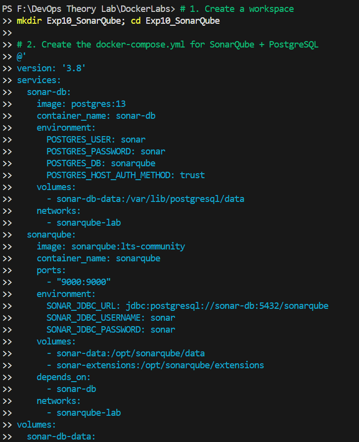
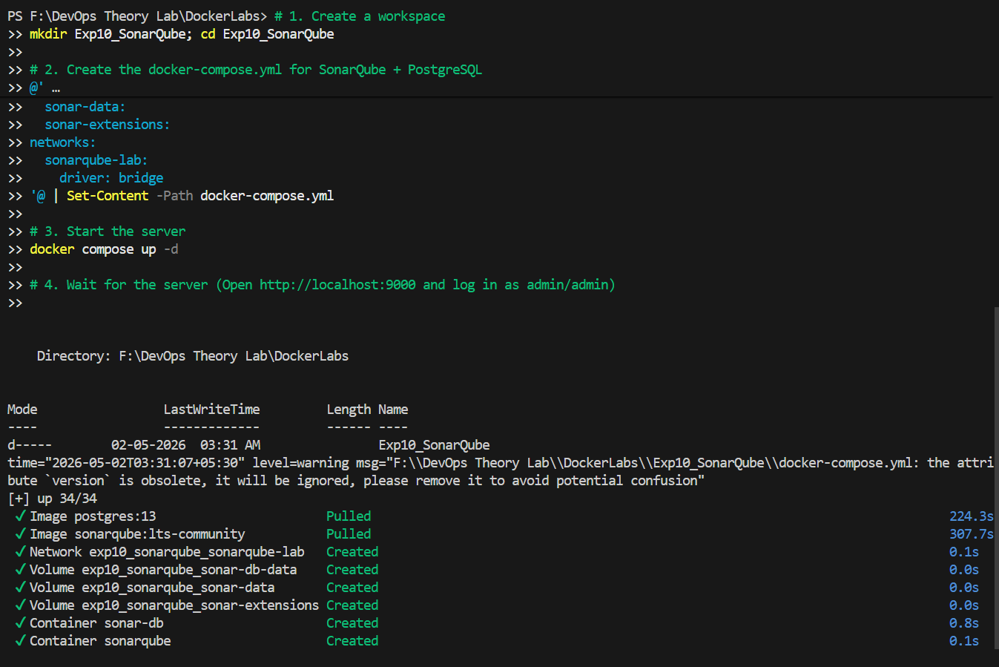
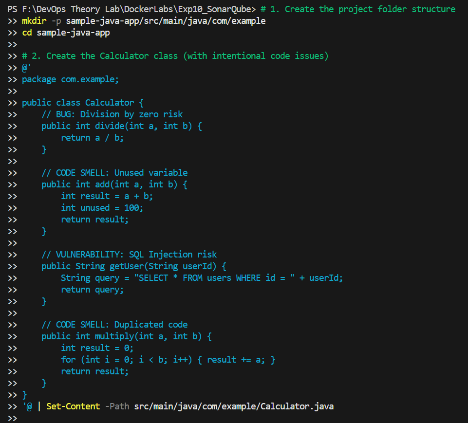
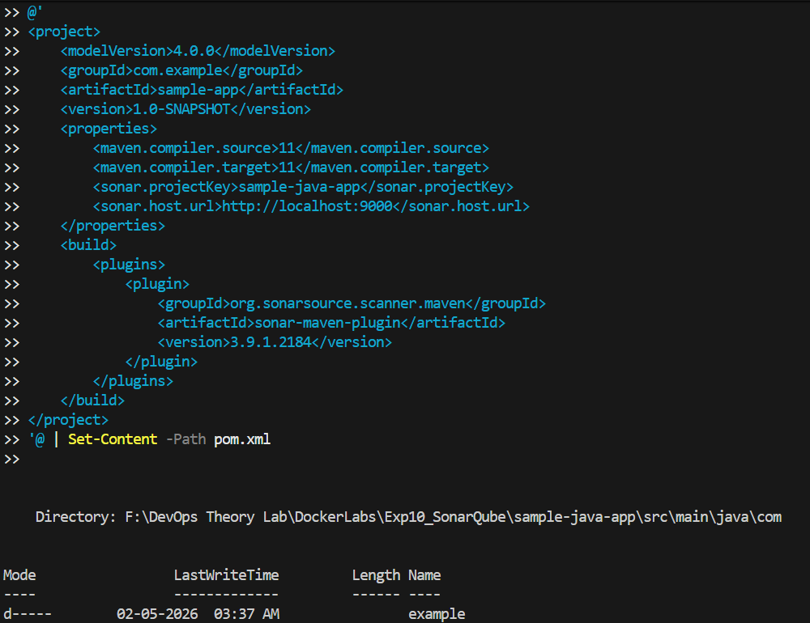
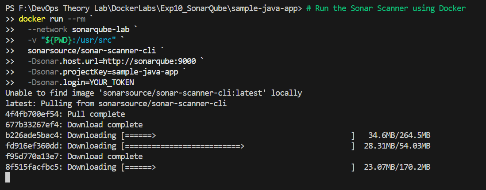
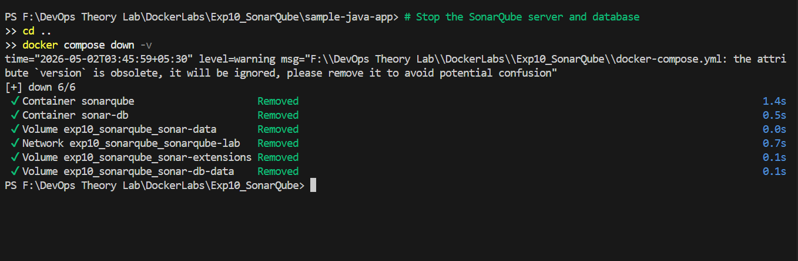

# Experiment 10: SonarQube — Static Code Analysis

**Date:** March 22, 2026  
**Lab Type:** Software Quality & Security  
**Difficulty Level:** Intermediate

---

## 1. Theory

### Problem Statement
Code bugs and security issues are often found too late—during testing or after deployment. Manual code reviews are slow, inconsistent, and difficult to scale as teams grow.

### What is SonarQube?
SonarQube is an open-source platform that automatically scans source code for **bugs**, **security vulnerabilities**, and **maintainability issues** without executing the code. This process is known as **Static Application Security Testing (SAST)** or simply **Static Analysis**.

### Key Concepts
| Term | Description |
|------|-------------|
| **Quality Gate** | A set of rules that code must pass before it can be deployed (the "Go/No-Go" check). |
| **Bug** | Code that will likely break or behave incorrectly at runtime. |
| **Vulnerability** | A security weakness that could be exploited by an attacker. |
| **Code Smell** | Code that works but is poorly written, hard to maintain, or violates best practices. |
| **Technical Debt**| The estimated time required to fix all current issues in the codebase. |
| **Coverage** | The percentage of source code covered by unit tests. |
| **Duplication** | Repeated code blocks that should be refactored into a single function. |

---

## 2. Lab Architecture
SonarQube consists of two distinct components that work together:

1.  **SonarQube Server ("The Brain")**: 
    - A web application that receives analysis reports.
    - Applies rules, tracks technical debt, and provides a visual dashboard.
    - Runs on port `9000` and uses a database (PostgreSQL) to persist results.
2.  **Sonar Scanner ("The Worker")**:
    - A command-line tool or plugin (Maven, Gradle, Jenkins) that reads your code.
    - Detects issues and sends a report to the server using a **Token** for authentication.

**Why Both Are Required?**
- Without the **Server**, there is nowhere to send results.
- Without the **Scanner**, no code gets analyzed.
- **Flow**: `Your Code` → `Sonar Scanner` → `SonarQube Server` → `Dashboard`.

---

## 3. Hands-on Lab

### Step 1: Start the SonarQube Server
We will use Docker Compose to deploy the SonarQube server and a PostgreSQL database.

Create a `docker-compose.yml` file:
```yaml
version: '3.8'

services:
  sonar-db:
    image: postgres:13
    container_name: sonar-db
    environment:
      POSTGRES_USER: sonar
      POSTGRES_PASSWORD: sonar
      POSTGRES_DB: sonarqube
      POSTGRES_HOST_AUTH_METHOD: trust
    volumes:
      - sonar-db-data:/var/lib/postgresql/data
    networks:
      - sonarqube-lab

  sonarqube:
    image: sonarqube:lts-community
    container_name: sonarqube
    ports:
      - "9000:9000"
    environment:
      SONAR_JDBC_URL: jdbc:postgresql://sonar-db:5432/sonarqube
      SONAR_JDBC_USERNAME: sonar
      SONAR_JDBC_PASSWORD: sonar
    volumes:
      - sonar-data:/opt/sonarqube/data
      - sonar-extensions:/opt/sonarqube/extensions
    depends_on:
      - sonar-db
    networks:
      - sonarqube-lab

volumes:
  sonar-db-data:
  sonar-data:
  sonar-extensions:

networks:
  sonarqube-lab:
    driver: bridge
```
**Start the server**: `docker-compose up -d`
*Access the dashboard at `http://localhost:9000`. Default login: `admin / admin`.*




### Step 2: Create a Sample Java App with Issues
Create a folder named `sample-java-app` and a Java class that intentionally contains bugs and code smells.

**src/main/java/com/example/Calculator.java**:
```java
package com.example;

public class Calculator {
    // BUG: Division by zero risk
    public int divide(int a, int b) {
        return a / b;
    }

    // CODE SMELL: Unused variable
    public int add(int a, int b) {
        int result = a + b;
        int unused = 100; 
        return result;
    }

    // VULNERABILITY: SQL Injection risk
    public String getUser(String userId) {
        String query = "SELECT * FROM users WHERE id = " + userId;
        return query;
    }

    // CODE SMELL: Duplicated code
    public int multiply(int a, int b) {
        int result = 0;
        for (int i = 0; i < b; i++) { result += a; }
        return result;
    }

    public int multiplyAlt(int a, int b) {
        int result = 0;
        for (int i = 0; i < b; i++) { result += a; } // DUPLICATE
        return result;
    }
}
```

**pom.xml (Maven Configuration)**:
```xml
<project>
    <modelVersion>4.0.0</modelVersion>
    <groupId>com.example</groupId>
    <artifactId>sample-app</artifactId>
    <version>1.0-SNAPSHOT</version>
    <properties>
        <maven.compiler.source>11</maven.compiler.source>
        <maven.compiler.target>11</maven.compiler.target>
        <sonar.projectKey>sample-java-app</sonar.projectKey>
        <sonar.host.url>http://localhost:9000</sonar.host.url>
    </properties>
    <build>
        <plugins>
            <plugin>
                <groupId>org.sonarsource.scanner.maven</groupId>
                <artifactId>sonar-maven-plugin</artifactId>
                <version>3.9.1.2184</version>
            </plugin>
        </plugins>
    </build>
</project>
```

### Step 3: Generate a Token (Manual UI Step)
1. Open `http://localhost:9000` and log in.
2. Go to **My Account** → **Security**.
3. Generate a token named `scanner-token`.
4. **Copy the token immediately** (it looks like `sqp_xxxxxxxx`).




### Step 4: Run the Scanner
Run the analysis using the Maven plugin (Replace `YOUR_TOKEN` with your copied token):
```bash
mvn sonar:sonar -Dsonar.login=YOUR_TOKEN
```


### Step 5: View Results
Open the dashboard at `http://localhost:9000`. You will see:
- **Bugs, Vulnerabilities, and Code Smells** count.
- **Quality Gate Status** (likely FAILED due to the intentional issues).
- **Technical Debt** estimation.



---

## 4. Integration & Best Practices

### CI/CD Integration (Jenkins)
In a production environment, SonarQube is integrated into the Jenkins pipeline:
```groovy
stage('SonarQube Analysis') {
    steps {
        withSonarQubeEnv('SonarQube') {
            sh 'mvn clean verify sonar:sonar'
        }
    }
}
stage('Quality Gate') {
    steps {
        timeout(time: 5, unit: 'MINUTES') {
            waitForQualityGate abortPipeline: true
        }
    }
}
```

### Tool Comparison Matrix
| Feature | Jenkins | Ansible | SonarQube |
|---------|---------|---------|-----------|
| **Purpose** | Pipeline Orchestration | Config Management | Code Quality |
| **Role** | The Conductor | The Mechanic | The Inspector |
| **Input** | Triggers (Git push) | Inventory Files | Source Code |
| **Output** | Deployed App | Configured Server | Quality Report |

### Best Practices
- **Scan Early**: Scan every Pull Request, not just nightly builds.
- **Enforce Quality Gates**: Block deployments if coverage drops or critical bugs are found.
- **Zero Technical Debt**: Fix issues as they appear rather than letting them accumulate.
- **Security**: Never hardcode tokens in your `pom.xml` or source files; use environment variables or secret managers.
