# Experiment 6: Docker Run vs. Docker Compose

**Date:** March 05, 2026  
**Lab Type:** Multi-Container Orchestration  
**Difficulty Level:** Intermediate

---

## PART A – THEORY

### 1. Objective
To understand the relationship between `docker run` and **Docker Compose**, and to compare their configuration syntax and use cases.

### 2. Background Theory

#### 2.1 Docker Run (Imperative Approach)
The `docker run` command is used to create and start a container from an image. It requires explicit flags for:
- Port mapping (`-p`)
- Volume mounting (`-v`)
- Environment variables (`-e`)
- Network configuration (`--network`)
- Restart policies (`--restart`)
- Resource limits (`--memory`, `--cpus`)
- Container name (`--name`)

This approach is **imperative**, meaning you provide step-by-step instructions.

**Example:**
```bash
docker run -d \
  --name my-nginx \
  -p 8080:80 \
  -v ./html:/usr/share/nginx/html \
  -e NGINX_HOST=localhost \
  --restart unless-stopped \
  nginx:alpine
```

#### 2.2 Docker Compose (Declarative Approach)
Docker Compose uses a YAML file (`docker-compose.yml`) to define services, networks, and volumes in a structured format. Instead of multiple `docker run` commands, a single command is used:
```bash
docker compose up -d
```
Compose is **declarative**, meaning you define the desired state of the application.

**Equivalent Compose file:**
```yaml
version: '3.8'

services:
  nginx:
    image: nginx:alpine
    container_name: my-nginx
    ports:
      - "8080:80"
    volumes:
      - ./html:/usr/share/nginx/html
    environment:
      NGINX_HOST: localhost
    restart: unless-stopped
```

### 3. Mapping: Docker Run vs Docker Compose

| Docker Run Flag | Docker Compose Equivalent |
| :--- | :--- |
| `-p 8080:80` | `ports:` |
| `-v host:container` | `volumes:` |
| `-e KEY=value` | `environment:` |
| `--name` | `container_name:` |
| `--network` | `networks:` |
| `--restart` | `restart:` |
| `--memory` | `deploy.resources.limits.memory` |
| `--cpus` | `deploy.resources.limits.cpus` |
| `-d` | `docker compose up -d` |

### 4. Advantages of Docker Compose
- Simplifies multi-container applications
- Provides reproducibility
- Version controllable configuration
- Unified lifecycle management
- Supports service scaling (e.g., `docker compose up --scale web=3`)

---

## PART B – PRACTICAL TASK

### Task 1: Single Container Comparison

**Step 1: Run Nginx Using Docker Run**
```bash
docker run -d \
  --name lab-nginx \
  -p 8081:80 \
  -v $(pwd)/html:/usr/share/nginx/html \
  nginx:alpine
```
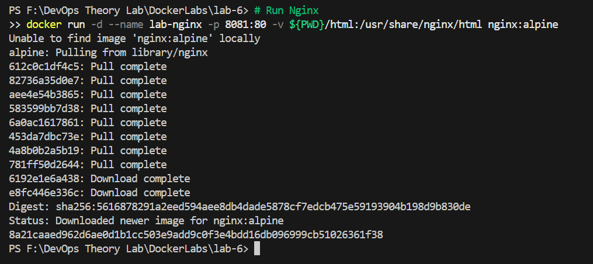
1. Verify using `docker ps`.
2. Access the site at `http://localhost:8081`.
3. Stop and remove the container: `docker stop lab-nginx && docker rm lab-nginx`.

**Step 2: Run Same Setup Using Docker Compose**
Create `docker-compose.yml`:
```yaml
version: '3.8'

services:
  nginx:
    image: nginx:alpine
    container_name: lab-nginx
    ports:
      - "8081:80"
    volumes:
      - ./html:/usr/share/nginx/html
```
1. Run: `docker compose up -d`.
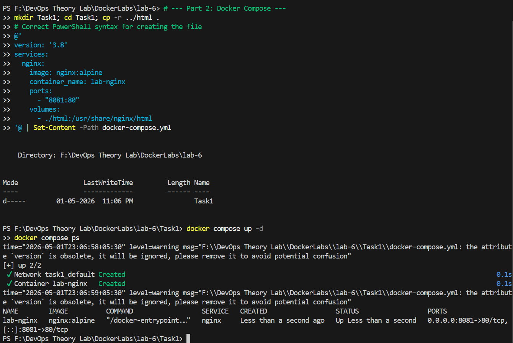
2. Verify: `docker compose ps`.
3. Stop: `docker compose down`.

### Task 2: Multi-Container Application (WordPress + MySQL)
**Objective**: Deploy WordPress with MySQL using both manual and structured methods.

#### A. Using Docker Run (Manual way)
```bash
# Create network
docker network create wp-net

# Run MySQL
docker run -d \
  --name mysql \
  --network wp-net \
  -e MYSQL_ROOT_PASSWORD=secret \
  -e MYSQL_DATABASE=wordpress \
  mysql:5.7

# Run WordPress
docker run -d \
  --name wordpress \
  --network wp-net \
  -p 8082:80 \
  -e WORDPRESS_DB_HOST=mysql \
  -e WORDPRESS_DB_PASSWORD=secret \
  wordpress:latest
```
*Test at `http://localhost:8082`.*
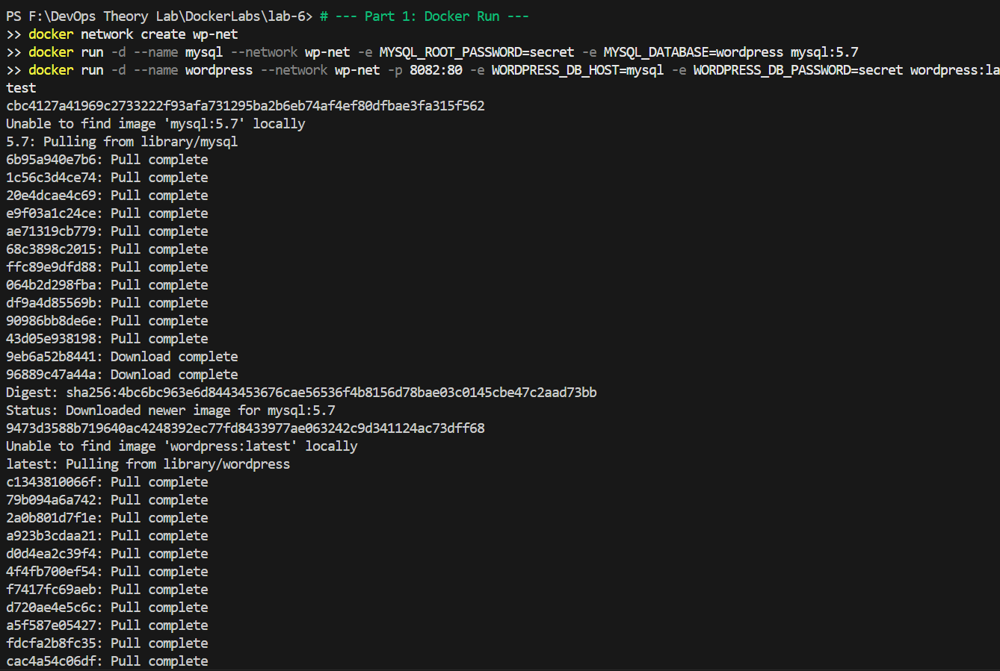

#### B. Using Docker Compose (Structured way)
Create `docker-compose.yml`:
```yaml
version: '3.8'

services:
  mysql:
    image: mysql:5.7
    environment:
      MYSQL_ROOT_PASSWORD: secret
      MYSQL_DATABASE: wordpress
    volumes:
      - mysql_data:/var/lib/mysql

  wordpress:
    image: wordpress:latest
    ports:
      - "8082:80"
    environment:
      WORDPRESS_DB_HOST: mysql
      WORDPRESS_DB_PASSWORD: secret
    depends_on:
      - mysql

volumes:
  mysql_data:
```
*Run: `docker compose up -d`.*
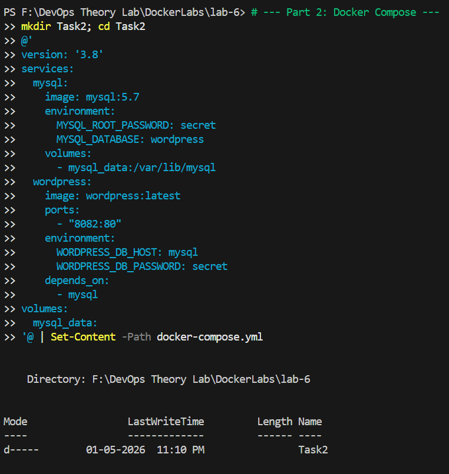
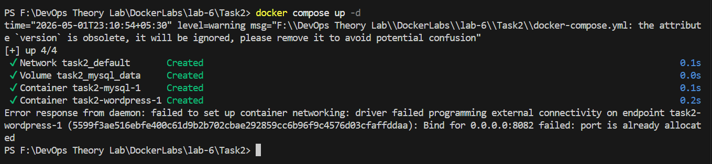
*Stop: `docker compose down -v`.*

---

## PART C – CONVERSION & BUILD-BASED TASKS

### Task 3: Convert Docker Run to Docker Compose

#### Problem 1: Basic Web Application
**Given Docker Run Command:**
```bash
docker run -d \
  --name webapp \
  -p 5000:5000 \
  -e APP_ENV=production \
  -e DEBUG=false \
  --restart unless-stopped \
  node:18-alpine
```
> **Student Task:** Write an equivalent `docker-compose.yml`. Ensure the same container name, port mapping, environment variables, and restart policy. Run using `docker compose up -d` and verify with `docker compose ps`.
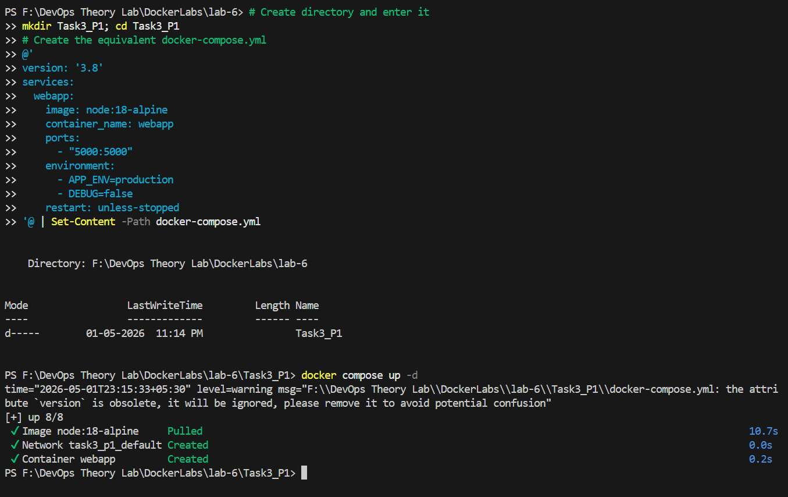

#### Problem 2: Volume + Network Configuration
**Given Docker Run Commands:**
```bash
docker network create app-net
docker run -d \
  --name postgres-db \
  --network app-net \
  -e POSTGRES_USER=admin \
  -e POSTGRES_PASSWORD=secret \
  -v pgdata:/var/lib/postgresql/data \
  postgres:15
docker run -d \
  --name backend \
  --network app-net \
  -p 8000:8000 \
  -e DB_HOST=postgres-db \
  -e DB_USER=admin \
  -e DB_PASS=secret \
  python:3.11-slim
```
> **Student Task:** Create a single `docker-compose.yml` file that defines both services, creates a named volume `pgdata`, creates a custom network `app-net`, and uses `depends_on`. Bring up the services using one command and ensure they can be removed properly.
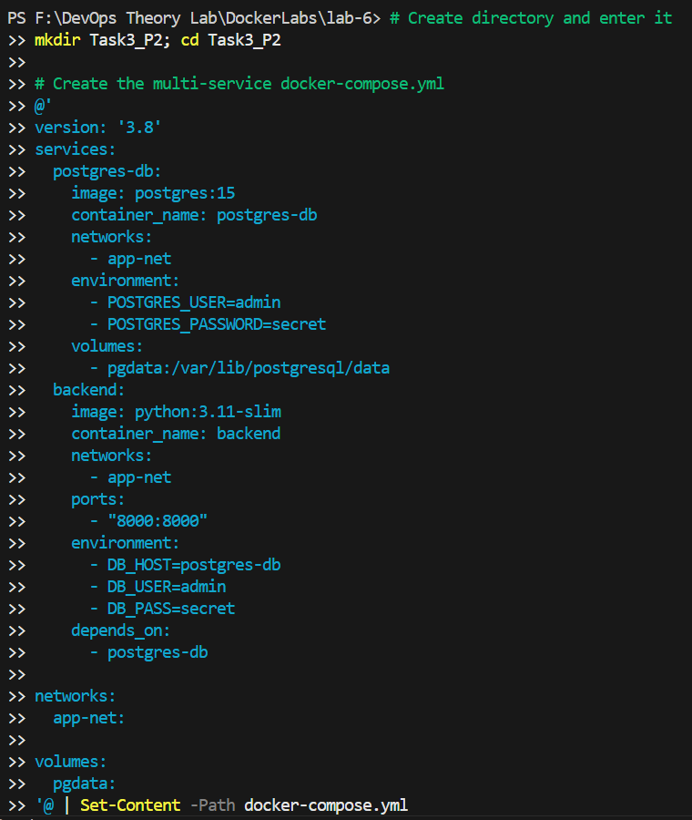
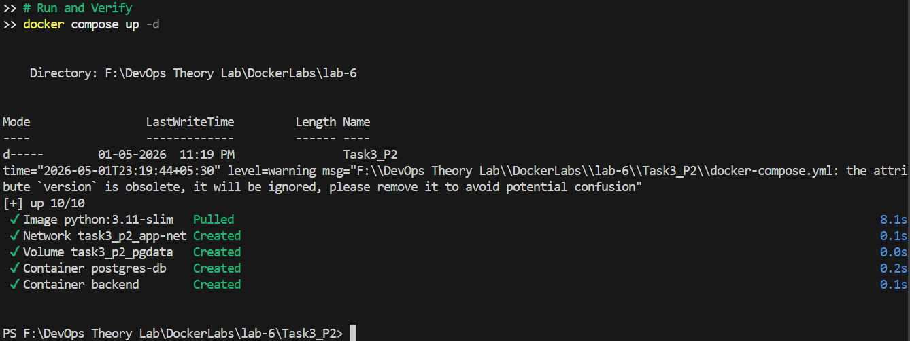

### Task 4: Resource Limits Conversion
**Given Docker Run Command:**
```bash
docker run -d \
  --name limited-app \
  -p 9000:9000 \
  --memory="256m" \
  --cpus="0.5" \
  --restart always \
  nginx:alpine
```
> **Student Task:** Convert this to Docker Compose. Add resource limits using the `deploy.resources.limits` configuration. Explain when `deploy` worked and the difference between normal Compose mode and Swarm mode.
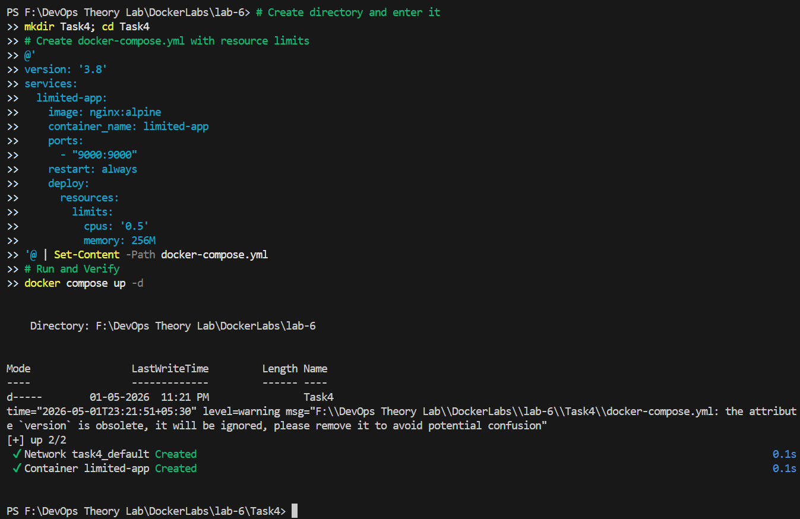

---

## PART D – USING DOCKERFILE INSTEAD OF STANDARD IMAGE

### Task 5: Replace Standard Image with Dockerfile (Node App)
Scenario: You are given `docker run -d -p 3000:3000 node:18-alpine`. Instead of using the prebuilt image, you must build your own.

**Step 1: Create app.js**
```javascript
const http = require('http');

http.createServer((req, res) => {
  res.end("Docker Compose Build Lab");
}).listen(3000);
```

**Step 2: Create Dockerfile**
```dockerfile
FROM node:18-alpine
WORKDIR /app
COPY app.js .
EXPOSE 3000
CMD ["node", "app.js"]
```

**Step 3: Create docker-compose.yml**
```yaml
version: '3.8'

services:
  nodeapp:
    build:
      context: .
      dockerfile: Dockerfile
    container_name: custom-node-app
    ports:
      - "3000:3000"
```

> **Student Task:** Build and run using `docker compose up --build -d`. Verify in browser at `http://localhost:3000`. Modify the `app.js` message, rebuild, and observe changes. Explain the difference between `image:` and `build:`.
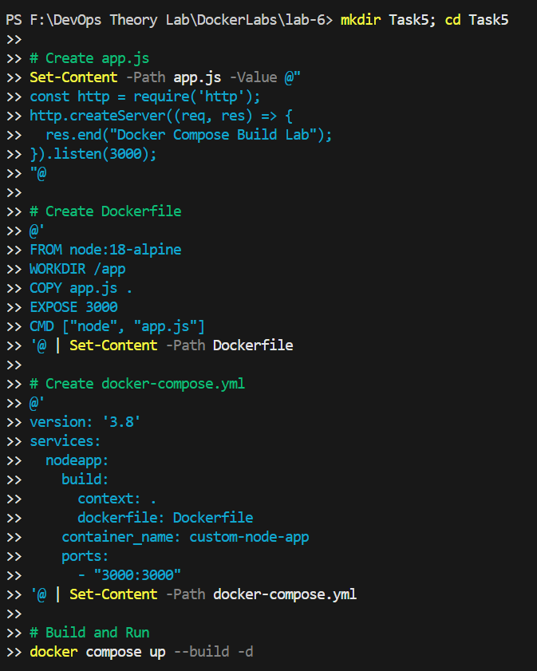
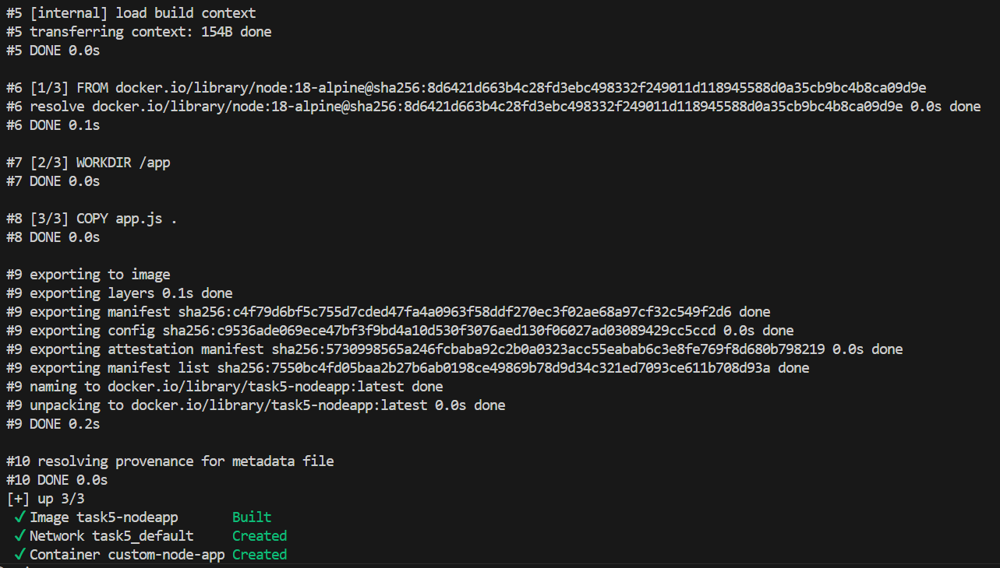

### Advanced Build Challenge (Task 6)
**Requirement**: Create a simple Python FastAPI or Node production-ready app using:
- Multi-stage Dockerfile
- Smaller final image
- Compose to build it

> **Must Include:** Write a multi-stage Dockerfile, use `build:` in Compose, add environment variables, and add a volume mount for development mode. Compare image sizes using `docker images`.

---

## EXPERIMENT 6 B: Multi-Container Application involving Docker Swarm

### 1. Objective
To deploy a multi-container application (WordPress + MySQL) using Docker Compose, understand persistence and networking, and learn scaling techniques including Docker Swarm.

### 2. Architecture Overview
- **User (Browser)** → **WordPress Container** → **MySQL Container** → **Persistent Volume**
- WordPress connects to MySQL using the service name (Internal DNS).

### 3. Step-by-Step Implementation

**Step 1: Create Project Directory**
```bash
mkdir wp-compose-lab && cd wp-compose-lab
```

**Step 2: Create docker-compose.yml**
```yaml
version: '3.9'

services:
  db:
    image: mysql:5.7
    container_name: wordpress_db
    restart: always
    environment:
      MYSQL_ROOT_PASSWORD: rootpass
      MYSQL_DATABASE: wordpress
      MYSQL_USER: wpuser
      MYSQL_PASSWORD: wppass
    volumes:
      - db_data:/var/lib/mysql

  wordpress:
    image: wordpress:latest
    container_name: wordpress_app
    depends_on:
      - db
    ports:
      - "8080:80"
    restart: always
    environment:
      WORDPRESS_DB_HOST: db:3306
      WORDPRESS_DB_USER: wpuser
      WORDPRESS_DB_PASSWORD: wppass
      WORDPRESS_DB_NAME: wordpress
    volumes:
      - wp_data:/var/www/html

volumes:
  db_data:
  wp_data:
```

### 3. Explanation of Key Sections
- **services**: Defines the containers (`db` for MySQL and `wordpress` for the application).
- **depends_on**: Ensures the database container starts before the WordPress application.
- **environment**: Configures database credentials and connection parameters.
- **volumes**: Ensures data persistence for the database and WordPress files even if containers are deleted.
- **ports**: Exposes the WordPress application on host port `8080`.

**Step 4-7: Operational Steps**
1. **Start**: `docker-compose up -d`. This pulls images, creates the network, and starts containers with DNS service discovery.
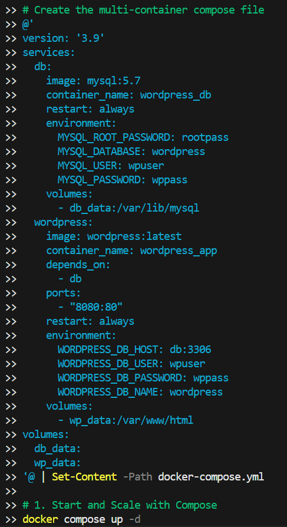
2. **Verify**: Check containers with `docker ps`.
3. **Access**: Open `http://localhost:8080` and complete the WordPress setup.
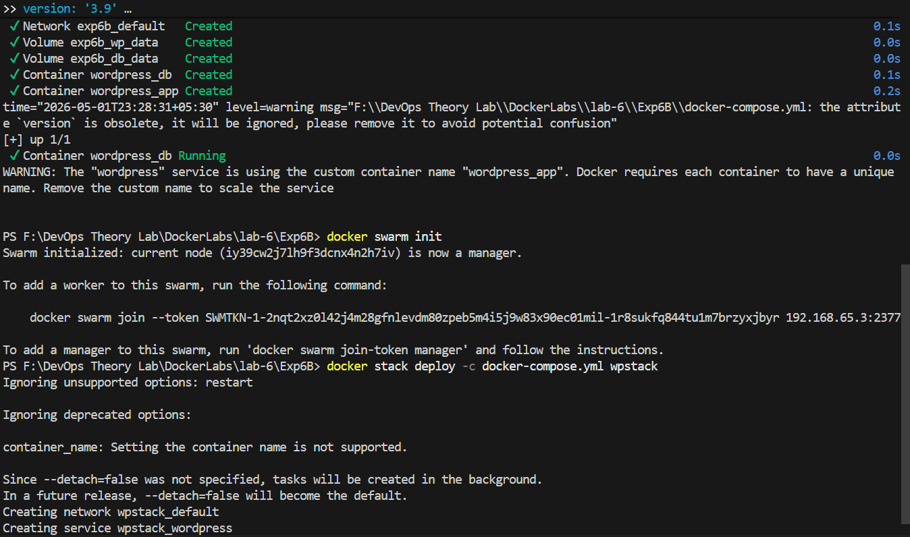
4. **Volumes**: Verify persistence folders with `docker volume ls` (`db_data` and `wp_data`).
5. **Stop**: `docker-compose down` removes containers but keeps volumes intact.

### 5. Scaling in Docker Compose
**Method 1: Scale WordPress Containers**
```bash
docker-compose up --scale wordpress=3
```
- **Result**: 3 WordPress containers running.
- **Problem**: All try to use the same host port (`8080`), and there is no built-in load balancing.
- **Solution**: Use a **Reverse Proxy (Nginx)**. You can add an Nginx service to handle load balancing:
  ```yaml
  nginx:
    image: nginx:latest
    ports:
      - "8080:80"
  ```
- **Limitations**: Docker Compose lacks built-in auto-healing, multi-host support, and production-ready scaling.

### 6. Running with Docker Swarm

**Step 1: Initialize Swarm**
```bash
docker swarm init
```
**Step 2: Deploy Stack**
```bash
docker stack deploy -c docker-compose.yml wpstack
```
**Step 3: Scale Service**
```bash
docker service scale wpstack_wordpress=3
```
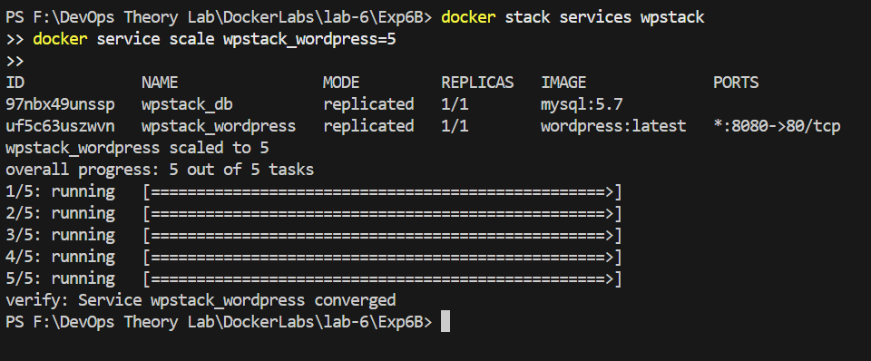

#### Comparison: Docker Compose vs Docker Swarm
| Metric | Docker Compose | Docker Swarm |
| :--- | :--- | :--- |
| **Scope** | Single host | Multi-node cluster |
| **Scaling** | Manual | Built-in |
| **Load Balancing**| No | Yes (Internal) |
| **Self-healing** | No | Yes |
| **Rolling Updates**| No | Yes |
| **Networking** | Basic | Overlay Network |

### 7. Benefits of Docker Swarm
- Built-in load balancing and self-healing.
- Horizontal scaling across nodes.
- Rolling updates without downtime.
- Service-level abstraction.

### 8. Challenges / Limitations of Swarm
- Less popular than Kubernetes (smaller ecosystem).
- Limited scheduling flexibility compared to K8s.
- Fewer advanced enterprise features.

### 9. Key Learning Outcomes
- Multi-container applications require orchestration for management.
- **Docker Compose** is ideal for local development, testing, and learning.
- **Docker Swarm** is useful for simple production clusters and easy scaling without the complexity of Kubernetes.

### 10. Conclusion
This experiment demonstrated how to deploy and manage multi-container applications using Docker Compose and Docker Swarm. We learned how containers communicate using internal networking, the importance of volumes for persistence, and the advantages of using Swarm for production-ready deployments.
