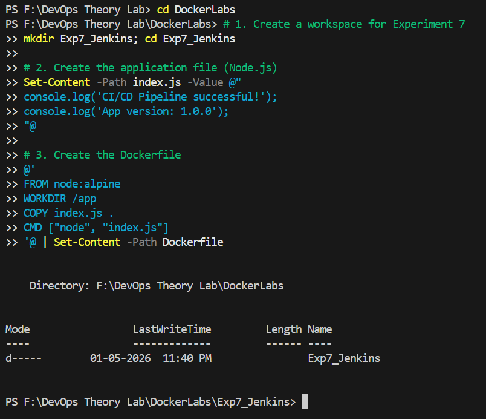
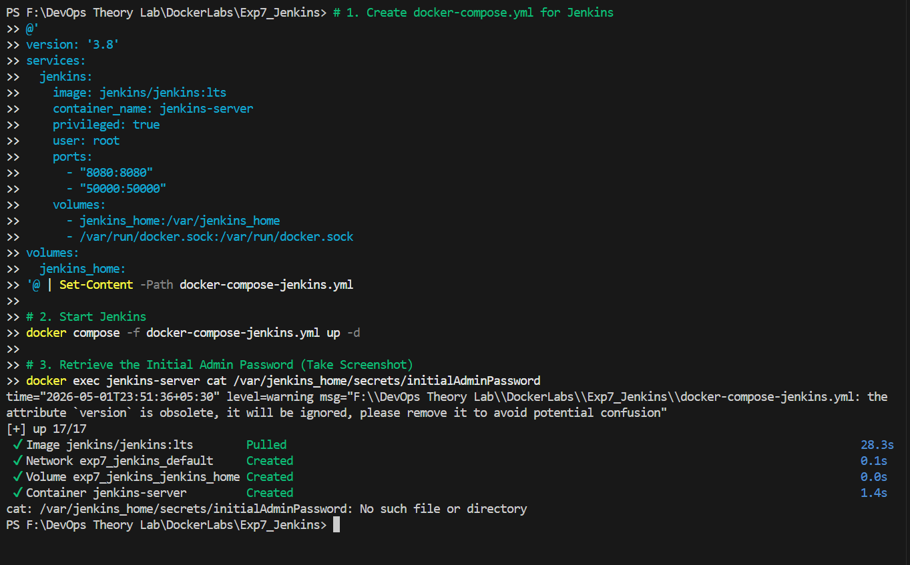

# Experiment 7: CI/CD using Jenkins, GitHub and Docker Hub

## 1. Aim
To design and implement a complete **CI/CD pipeline** using Jenkins, integrating source code from GitHub, and building & pushing Docker images to Docker Hub.

## 2. Objectives
- Understand CI/CD workflow using Jenkins (GUI-based tool).
- Create a structured GitHub repository with application and a `Jenkinsfile`.
- Build Docker images from source code automatically.
- Securely store Docker Hub credentials in Jenkins.
- Automate the build and push process using **GitHub Webhooks**.
- Use the same host (Docker) as a Jenkins agent via socket mounting.

## 3. Theory
- **Jenkins**: A web-based GUI automation server used to build, test, and deploy software. It features a rich plugin ecosystem (GitHub, Docker) and supports "Pipeline as Code."
- **CI/CD**:
    - **Continuous Integration (CI)**: Code is automatically built and tested after each commit.
    - **Continuous Deployment (CD)**: Built artifacts (Docker images) are automatically delivered or deployed.
- **Workflow**: `Developer` → `GitHub` → `Webhook` → `Jenkins` → `Build` → `Docker Hub`.

---

## Part A: GitHub Repository Setup

### 5.1 Project Structure
Create a repository named `my-app` with the following structure:
```text
my-app/
├── app.py
├── requirements.txt
├── Dockerfile
└── Jenkinsfile
```

### 5.2 Source Files
**app.py (Flask Application):**
```python
from flask import Flask
app = Flask(__name__)

@app.route("/")
def home():
    return "Hello from CI/CD Pipeline!"

if __name__ == "__main__":
    app.run(host="0.0.0.0", port=80)
```

**requirements.txt:**
```text
flask
```

**Dockerfile:**
```dockerfile
FROM python:3.10-slim
WORKDIR /app
COPY . .
RUN pip install -r requirements.txt
EXPOSE 80
CMD ["python", "app.py"]
```

### 5.3 Jenkinsfile (Pipeline Definition)
```groovy
pipeline {
    agent any

    environment {
        IMAGE_NAME = "your-dockerhub-username/myapp"
    }

    stages {
        stage('Clone Source') {
            steps {
                git 'https://github.com/your-username/my-app.git'
            }
        }

        stage('Build Docker Image') {
            steps {
                sh 'docker build -t $IMAGE_NAME:latest .'
            }
        }

        stage('Login to Docker Hub') {
            steps {
                withCredentials([string(credentialsId: 'dockerhub-token', variable: 'DOCKER_TOKEN')]) {
                    sh 'echo $DOCKER_TOKEN | docker login -u your-dockerhub-username --password-stdin'
                }
            }
        }

        stage('Push to Docker Hub') {
            steps {
                sh 'docker push $IMAGE_NAME:latest'
            }
        }
    }
}
```

---

## Part B: Jenkins Setup using Docker

### 6.1 Create Docker Compose File
```yaml
version: '3.8'

services:
  jenkins:
    image: jenkins/jenkins:lts
    container_name: jenkins
    restart: always
    ports:
      - "8080:8080"
      - "50000:50000"
    volumes:
      - jenkins_home:/var/jenkins_home
      - /var/run/docker.sock:/var/run/docker.sock
    user: root

volumes:
  jenkins_home:
```

### 6.2 Initialization
1. Start Jenkins: `docker-compose up -d`.
2. Access at `http://localhost:8080`.
3. Unlock Jenkins: `docker exec -it jenkins cat /var/jenkins_home/secrets/initialAdminPassword`.

4. Install suggested plugins and create an admin user.

---

## Part C: Jenkins Configuration

### 7.1 Add Docker Hub Credentials
- **Path**: Manage Jenkins → Credentials → System → Global credentials → Add Credentials.
- **Type**: Secret Text.
- **ID**: `dockerhub-token`.
- **Value**: Your Docker Hub Personal Access Token.

### 7.2 Create Pipeline Job
1. **New Item** → **Pipeline** → Name: `ci-cd-pipeline`.
2. **Configure**:
    - **Pipeline definition**: Pipeline script from SCM.
    - **SCM**: Git.
    - **Repo URL**: Your GitHub Repo URL.
    - **Script Path**: `Jenkinsfile`.

---

## Part D: GitHub Webhook Integration
1. In your GitHub repo: **Settings** → **Webhooks** → **Add Webhook**.
2. **Payload URL**: `http://<your-server-ip>:8080/github-webhook/`.
3. **Content type**: `application/json`.
4. **Events**: Just the `push` event.

---

## Part E: Understanding Jenkins Pipeline Syntax

### Key Terms
- **`pipeline`**: The root block containing the entire definition.
- **`agent any`**: Tells Jenkins to run this pipeline on any available node.
- **`stages`**: Groups the different phases (Clone, Build, Auth, Push).
- **`steps`**: The actual commands (e.g., `sh`, `git`, `echo`).
- **`withCredentials`**: A secure way to inject sensitive data (like tokens) into the environment temporarily without hardcoding them in the script.

### The `withCredentials` Logic
```groovy
withCredentials([string(credentialsId: 'dockerhub-token', variable: 'DOCKER_TOKEN')]) {
    sh 'echo $DOCKER_TOKEN | docker login -u username --password-stdin'
}
```
1. **Part**: `string` (Secret type).
2. **credentialsId**: The ID you set in Jenkins UI (`dockerhub-token`).
3. **variable**: The temporary name used in the script (`DOCKER_TOKEN`).
4. **Logic**: Jenkins fetches the secret, assigns it to the variable, executes the block, and then deletes the variable.

---

## Observations & Results
- **Automation**: Once configured, a simple `git push` triggers the entire build and push process.
- **Security**: Credentials are managed centrally in Jenkins and never exposed in the source code.
- **Portability**: Docker ensures that the application environment is consistent from the developer's machine to the final production image.


