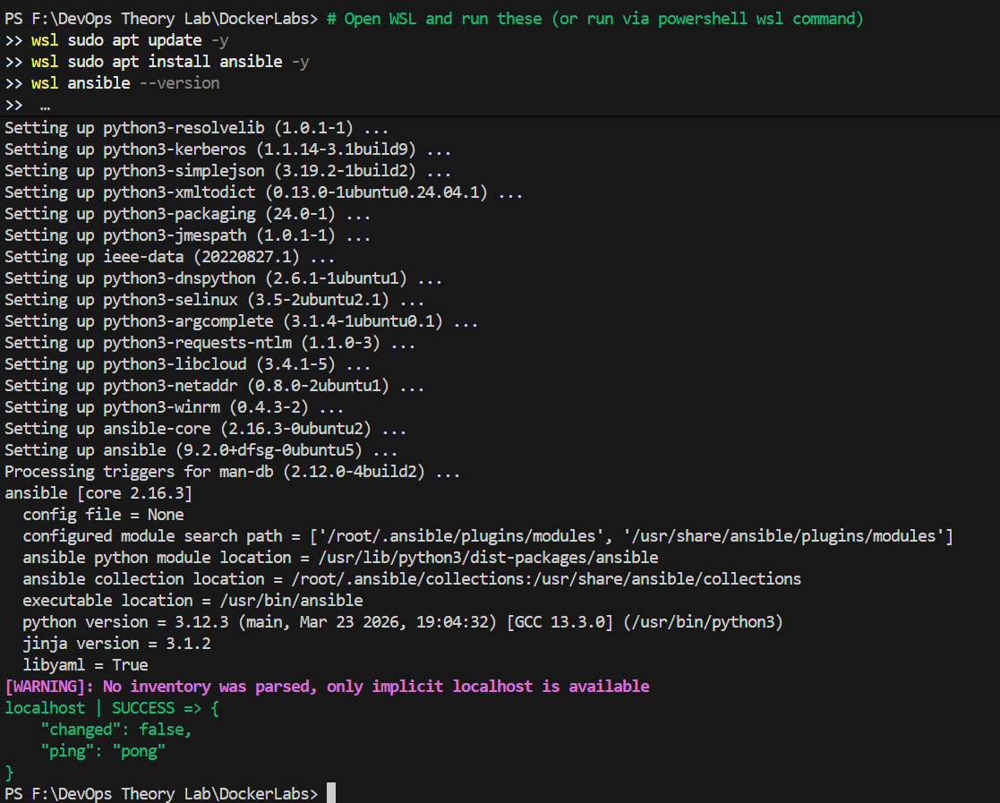
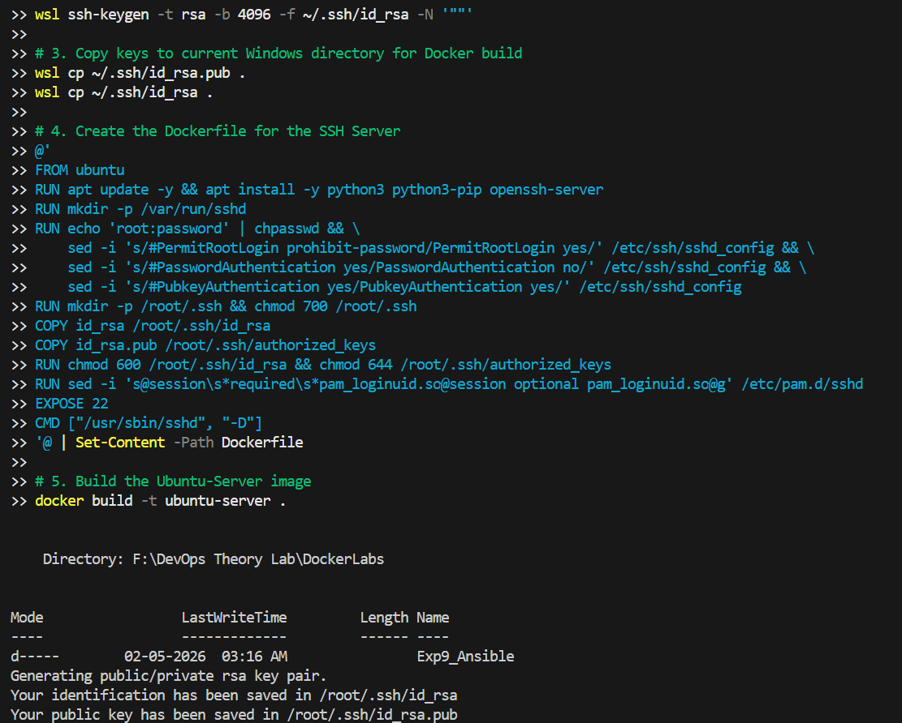
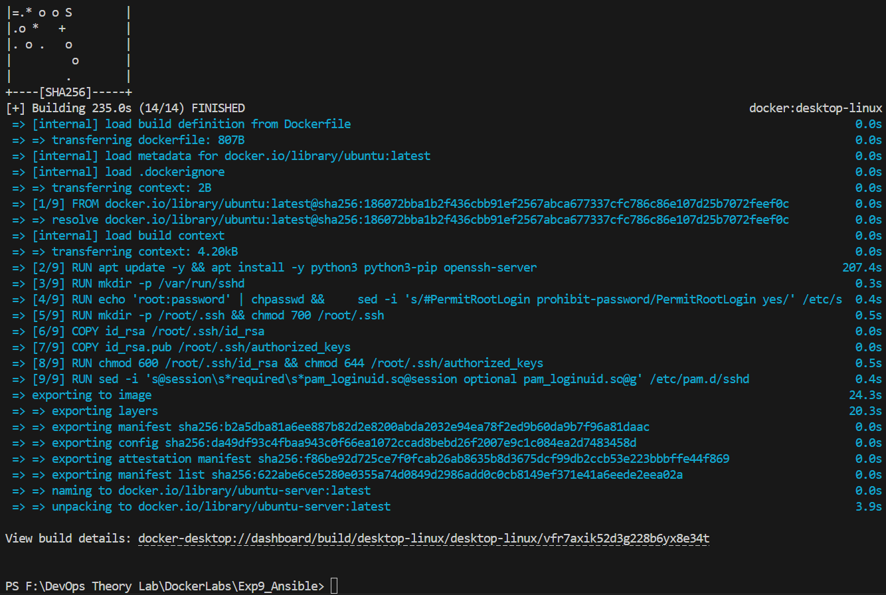
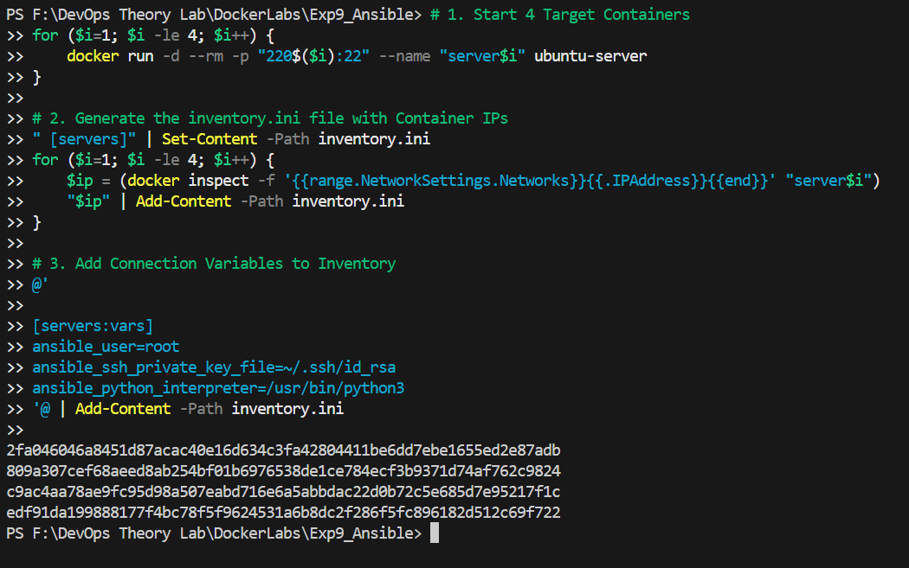
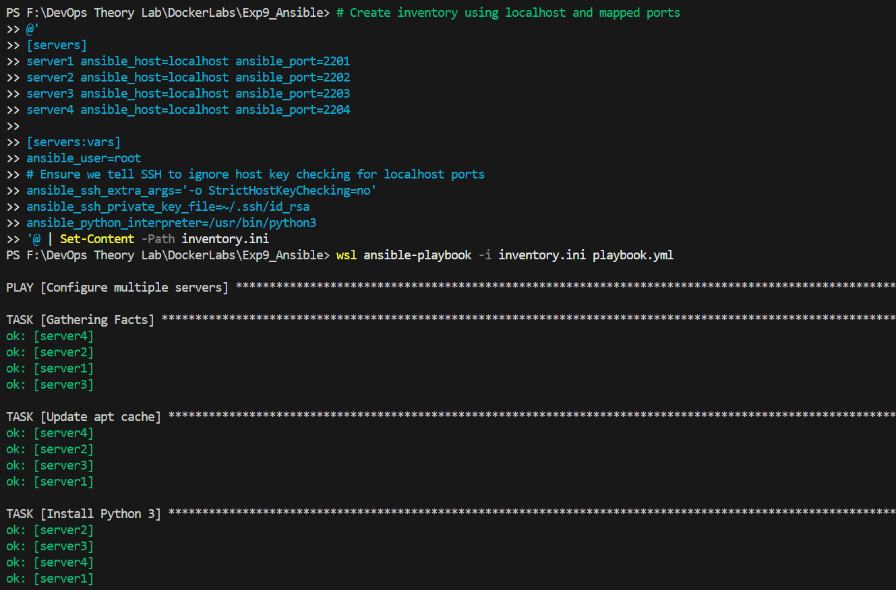
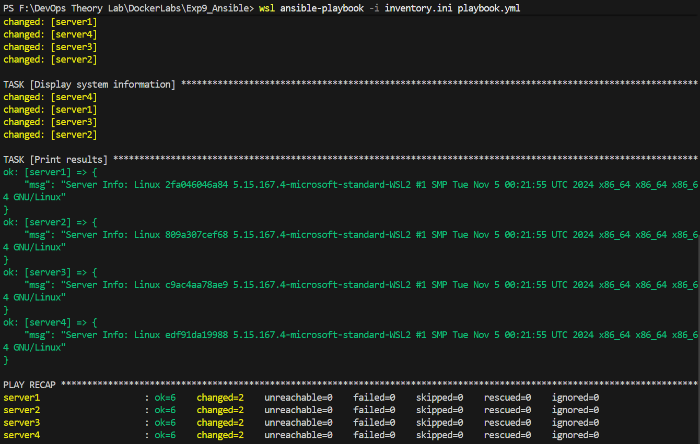

# Experiment 9: Infrastructure Automation using Ansible (Windows/WSL Guide)

## 1. Theory

### Problem Statement
Managing infrastructure manually across multiple servers leads to **configuration drift**, inconsistent environments, and time-consuming repetitive tasks. Scaling from one server to hundreds becomes nearly impossible with manual SSH-based administration.

### What is Ansible?
Ansible is an open-source automation tool for configuration management, application deployment, and orchestration. It is the enterprise standard for cross-platform automation.
- **Agentless Architecture**: No software installation required on managed nodes; uses SSH for Linux and WinRM for Windows.
- **Idempotency**: Running playbooks multiple times yields the same result, ensuring predictable system states.
- **Declarative Syntax**: You describe the *desired state* (e.g., "Nginx should be installed"), rather than the steps to install it.
- **Push-based**: Changes are initiated from the control node and pushed to the targets immediately.

#### How Ansible Works
Ansible uses the concepts of **Control** and **Managed** nodes.
- **Modules**: Small units of code executed on managed nodes to perform tasks (e.g., `apt`, `copy`, `service`).
- **Tasks**: Individual actions within a playbook that invoke a specific module.
- **Playbooks**: YAML files containing an ordered list of tasks to define the desired state of the system.
- **Inventory**: A simple file that groups all the nodes into different categories.

Ansible leverages **YAML**, a human-readable data format, making it easy to understand and use from day one. It requires no extra agents on the managed nodes—typically, only a terminal and a text editor are needed.

### Benefits of Ansible
- **Community-Powered**: Free, open-source, and battle-tested by a huge audience.
- **Low Barrier to Entry**: No special coding skills required.
- **Agentless**: Simple deployment workflow using standard SSH.
- **Modular & Reusable**: Features for organizing automation as users become proficient.
- **Documented**: Extensive official and community documentation.

---

## PART A – PRACTICAL TASK

### 2. Ansible Installation on Windows (via WSL)
Ansible does not run natively on Windows, but it runs perfectly within the **Windows Subsystem for Linux (WSL)**.

#### Step 1: Update WSL Packages
```bash
sudo apt update -y
```

#### Step 2: Install Ansible
You can install Ansible using the Python package manager (`pip`) or the system package manager (`apt`).
**Option A (Recommended for Ubuntu/WSL):**
```bash
sudo apt install ansible -y
```
**Option B (Latest version via pip):**
```bash
pip install ansible
```

#### Step 3: Verify Installation
```bash
ansible --version
```

#### Step 4: Post-Installation Check
Test Ansible locally on your WSL instance:
```bash
ansible localhost -m ping
```
**Expected Output:**
```json
localhost | SUCCESS => {
    "changed": false,
    "ping": "pong"
}
```


---

## 3. Ansible Demo with Docker Containers
We will use Docker containers as "servers" to demonstrate how Ansible manages remote infrastructure.

### Step 1: Create SSH Key Pair in WSL
Generate an RSA key pair to enable passwordless authentication:
```bash
# Generate key pair (Press Enter for all prompts)
ssh-keygen -t rsa -b 4096

# Copy keys to current directory for Docker image build
cp ~/.ssh/id_rsa.pub .
cp ~/.ssh/id_rsa .
```
- **id_rsa**: Your **Private Key**. Stay on your local machine. Never share it.
- **id_rsa.pub**: Your **Public Key**. Placed on servers to grant you access.



### Step 2: Create Dockerfile for SSH Server
Create a file named `Dockerfile` to build an Ubuntu image with an SSH server:
```dockerfile
FROM ubuntu

RUN apt update -y && apt install -y python3 python3-pip openssh-server
RUN mkdir -p /var/run/sshd

# Configure SSH for remote access
RUN echo 'root:password' | chpasswd && \
    sed -i 's/#PermitRootLogin prohibit-password/PermitRootLogin yes/' /etc/ssh/sshd_config && \
    sed -i 's/#PasswordAuthentication yes/PasswordAuthentication no/' /etc/ssh/sshd_config && \
    sed -i 's/#PubkeyAuthentication yes/PubkeyAuthentication yes/' /etc/ssh/sshd_config

# Set up SSH directory
RUN mkdir -p /root/.ssh && chmod 700 /root/.ssh

# Copy SSH keys into the image (For Lab Purposes Only)
COPY id_rsa /root/.ssh/id_rsa
COPY id_rsa.pub /root/.ssh/authorized_keys

# Set correct security permissions
RUN chmod 600 /root/.ssh/id_rsa && chmod 644 /root/.ssh/authorized_keys

# Fix for PAM login
RUN sed -i 's@session\s*required\s*pam_loginuid.so@session optional pam_loginuid.so@g' /etc/pam.d/sshd

EXPOSE 22
CMD ["/usr/sbin/sshd", "-D"]
```

### Step 3: Build and Run the Container
```bash
# Build the image
docker build -t ubuntu-server .

# Run the container (Map port 2222 on host to 22 in container)
docker run -d -p 2222:22 --name ssh-test-server ubuntu-server
```


### Step 4: Test SSH Connections
```bash
# Test using the Private Key
ssh -i ~/.ssh/id_rsa root@localhost -p 2222
```
*If successful, you will log in to the container without being asked for a password.*


---

## 4. Multi-Container Ansible Exercise

### Step 1: Start 4 Test Servers
```bash
for i in {1..4}; do
  docker run -d --rm -p 220${i}:22 --name server${i} ubuntu-server
done
```

### Step 2: Create Ansible Inventory (`inventory.ini`)
```bash
# Get container IPs and set up variables
echo "[servers]" > inventory.ini
for i in {1..4}; do
  IP=$(docker inspect -f '{{range.NetworkSettings.Networks}}{{.IPAddress}}{{end}}' server${i})
  echo "$IP" >> inventory.ini
done

cat << EOF >> inventory.ini

[servers:vars]
ansible_user=root
ansible_ssh_private_key_file=~/.ssh/id_rsa
ansible_python_interpreter=/usr/bin/python3
EOF
```

### Step 3: Create and Run Playbook (`playbook.yml`)
```yaml
---
- name: Configure multiple servers
  hosts: servers
  become: yes

  tasks:
    - name: Update apt cache
      apt:
        update_cache: yes

    - name: Install Python 3
      apt:
        name: python3
        state: latest

    - name: Create a custom test file
      copy:
        dest: /root/ansible_result.txt
        content: |
          Provisioned by Ansible
          Host: {{ inventory_hostname }}
          Date: {{ ansible_date_time.date }}

    - name: Display system information
      command: uname -a
      register: sys_info

    - name: Show disk space
      command: df -h
      register: disk_space

    - name: Print results
      debug:
        msg: 
          - "System info: {{ sys_info.stdout }}"
          - "Disk space: {{ disk_space.stdout_lines }}"
```
**Execute**: `ansible-playbook -i inventory.ini playbook.yml`


### Step 4: Verification and Cleanup
```bash
# Verify file creation
for i in {1..4}; do docker exec server${i} cat /root/ansible_result.txt; done

# Cleanup
for i in {1..4}; do docker stop server${i}; done
```


---

## 5. The Need for Ansible in Server Management
Ansible addresses several critical challenges:
- **Scalability**: Manual management becomes impractical as infrastructure grows.
- **Consistency**: Ensures identical configurations across all servers.
- **Efficiency**: Automates repetitive tasks, reducing time and human error.
- **Idempotency**: Operations can be run multiple times safely.
- **Infrastructure as Code (IaC)**: Configuration is version-controlled and documented.

### Key Features of Ansible
- **Agentless**: Uses standard SSH (no extra software on targets).
- **YAML-Based**: Simple, human-readable automation scripts.
- **Modules**: Over 3,000+ built-in modules for cloud, networking, and containers.
- **Multi-Platform**: Supports Linux, Windows, AWS, Azure, and more.

---

## PART B: OPTIONAL – ADVANCED LOCAL TESTING

### 1. Set up a Local Environment
For testing without Docker, you can use **Vagrant** or **VirtualBox** to spin up virtual machines.
```bash
# Example Vagrant setup
vagrant init ubuntu/bionic64
vagrant up
```

### 2. Local Inventory and Playbooks
For local testing, create an inventory pointing to `localhost`:
```ini
[local]
localhost ansible_connection=local
```

**Playbook Example (`install_nginx.yml`):**
```yaml
---
- name: Install Nginx on localhost
  hosts: local
  become: yes
  tasks:
    - name: Install nginx package
      apt:
        name: nginx
        state: present
```
**Run**: `ansible-playbook -i inventory.ini install_nginx.yml`

### 3. Advanced Features to Explore
- **Ansible Vault**: Encrypt sensitive data like passwords using `ansible-vault create secrets.yml`.
- **Ansible Galaxy**: Install pre-built collections and roles using `ansible-galaxy collection install community.general`.
- **Handlers**: Trigger specific actions (like restarting a service) only when a configuration change occurs.

---

## Conclusion
This experiment demonstrated the power of Ansible for infrastructure automation. We covered:
1. Agentless configuration using SSH.
2. Managing multi-container environments with inventory files.
3. Writing declarative YAML playbooks to ensure system consistency.
`
