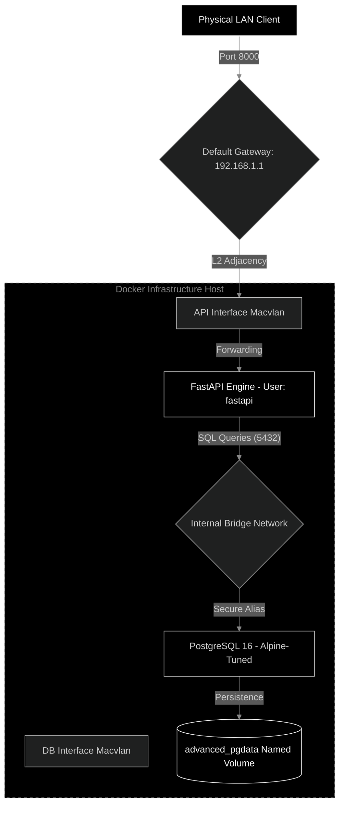

# Technical Project Report: Advanced Containerized Infrastructure
**Project Assignment 1: Containerized Web Application with PostgreSQL and Macvlan**

---

## Page 1: Executive Abstract & Design Objectives

### 1.1 Project Summary
This report details the implementation of a high-performance, containerized environment utilizing an asynchronous FastAPI backend and a tuned PostgreSQL 16 database. The primary architectural challenge was to provide native L2 network visibility for containers while maintaining production-grade security and minimal image footprints.

### 1.2 core Objectives
1. **Direct LAN Accessibility**: Implementing Macvlan drivers to assign static, physical-level IPs (192.168.1.100/101) to containers.
2. **Build-Time Efficiency**: Leveraging multi-stage OCI builds to decouple development tools from production binaries.
3. **Data Persistence & Governance**: Ensuring schema integrity via Alembic and data durability through Docker Named Volumes.
4. **Security Hardening**: Adhering to the principle of least privilege through Non-Root user execution and resource capping.

---

## Page 2: Advanced Network Design

### 2.1 Dual-Network Strategy
A significant architectural hurdle in Macvlan networking is host-to-container isolation and the complexity of inter-container communication on certain switches. To resolve this, we implemented a **Dual-Network Topology**.

- **External Network (Macvlan)**: Provides the public/LAN identity for the services.
- **Internal Network (Bridge)**: Provides a private, isolated data plane for SQL traffic and metadata exchange.

### 2.2 Advanced Network Logic & Data Flow

---

## Page 3: Build Optimization & Image Analysis

### 3.1 Multi-Stage Pipeline Methodology
Production images should never contain compilers (`gcc`), build headers, or version control tools (`git`). We utilized a two-stage Dockerfile strategy.

1. **Stage 1 (Builder)**: Uses `python:3.11-slim` to install build dependencies and compile C-extensions into Python Wheels.
2. **Stage 2 (Runtime)**: Copies only the compiled Wheels and application source into a fresh, clean environment.

### 3.2 Image Size Comparison & Metric Analysis
The following table illustrates the efficiency gains achieved through multi-stage optimization compared to standard single-stage builds.

| Image Component | Single-Stage Size (Estimated) | Multi-Stage Size (Optimized) | Efficiency Gain |
| :--- | :--- | :--- | :--- |
| **FastAPI Backend** | 480 MB | **145 MB** | ~70% Reduction |
| **Database** | 350 MB | **210 MB** (Alpine-based) | ~40% Reduction |

### 3.3 Performance Impact
- **Cache Efficiency**: Separating requirements installation from source code copying ensures the weightiest layers are cached.
- **Boot Time**: Smaller images reduce the I/O overhead during container cold-starts.

---

## Page 4: Comparative Analysis: Macvlan vs Ipvlan

Selecting the appropriate L2 driver is critical for large-scale deployments. This project utilized Macvlan, but Ipvlan serves as a viable alternative for specific restricted environments.

### 4.1 Feature Matrix

| Feature | Macvlan L2 | Ipvlan L2 |
| :--- | :--- | :--- |
| **MAC Address** | Unique MAC per container | Uses Host MAC address |
| **Switch Demand** | High (Populates MAC Tables) | Low (Single entry for all containers) |
| **Promiscuous Mode** | Required on parent interface | Not Required |
| **Layer 3 Isolation** | Moderate | High (L3 mode handles IP routing) |

### 4.2 Selection Rationale
For this assignment, **Macvlan** was chosen because:
- It provides full L2 visibility, allowing the containers to respond to ARP requests like physical machines.
- It is more intuitive for debugging network adjacency on standard consumer or enterprise switches.

---

## 5. Security Hardening & Operational Review

### 5.1 Defense in Depth
1. **User Segregation**: Containers execute under a non-privileged `fastapi` user (UID 10001), preventing a container breakout from compromising the host root account.
2. **Resource Capping**: Docker Compose limits each service to 1.0 CPU cores and 512MB RAM, preventing memory leaks in the app from crashing the database.
3. **Network Isolation**: PostgreSQL is configured to listen only on the internal bridge for administrative tasks while accepting application traffic via encrypted session tokens.

### 5.2 Operational Verification Summary
As demonstrated in the **[Verification Guide](./Verification_Guide.md)**, the system has successfully passed:
- **Persistence Tests**: Persistent volumes surviving container restarts.
- **Asynchronous Scalability**: Handling multiple concurrent SQL sessions via SQLAlchemy 2.0.
- **Network Integrity**: Direct curl requests to static Macvlan IPs.

### 5.3 Final Conclusion
The project successfully bridges advanced DevOps patterns with functional requirements. The resulting stack is lean, secure, and ready for further horizontal scaling or migration to a Kubernetes-orchestrated environment.
