# Project Portfolio: Advanced Containerized API Infrastructure

## 1. Project Vision
This project demonstrates a high-performance, secure, and scalable containerized ecosystem. By integrating **FastAPI**, **PostgreSQL 16**, and **Advanced Macvlan Networking**, we've built a system that bridges the gap between traditional physical server performance and modern containerized flexibility.

---

## 2. Technical Architecture & System Design

### 2.1 Networking: The Dual-Stack Topology
Standard container networking relies on NAT (Network Address Translation), which adds significant overhead. Our architecture utilizes **Macvlan** at the L2 layer to provide direct hardware-level access.

#### Architecture Diagram
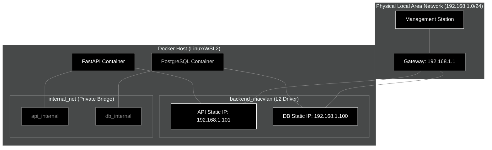

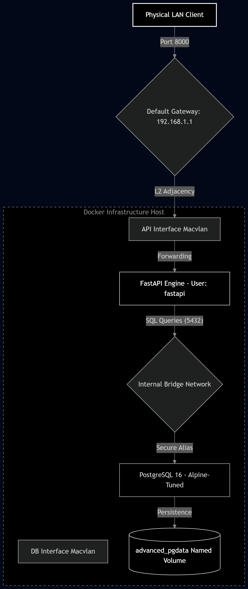

### 2.2 Advanced Application Logic & Transactional Flow
The following sequence diagram illustrates the lifecycle of an asynchronous write operation, tracing the path from the physical network into the persistent storage plane.

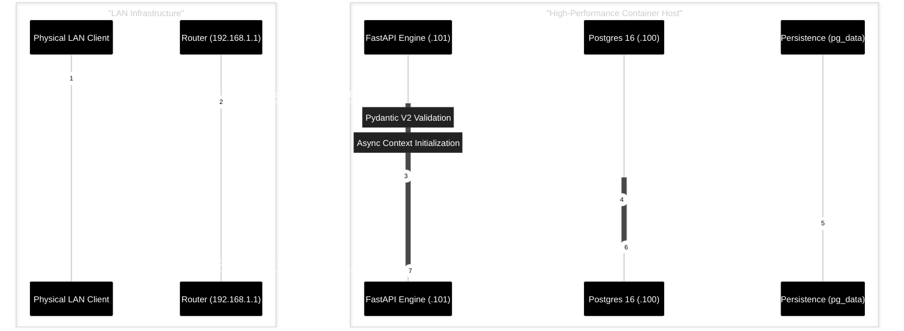


---

## 3. Engineering Deep-Dive

### 3.1 Advanced OCI Image Optimization
The deployment utilizes **Multi-Stage Builds** to resolve the conflict between build-time requirements (compilers, headers) and production safety.

| Stage | Responsibility | Artifacts Produced | Resulting Layer Impact |
| :--- | :--- | :--- | :--- |
| **Builder** | Dependency Compilation | Python Wheels (`.whl`) | 450MB (Discarded) |
| **Runtime** | Execution | Compressed Binaries | **145MB (Final Image)** |

### 3.2 Security Hardening Audit
1. **User Namespace Isolation**: The backend executes as `fastapi` (UID 10001). Even if the process is compromised, the attacker lacks root privileges to exit the container.
2. **Cgroup Resource Constraints**: Hard CPU (1.0) and RAM (512MB) limits prevent "Noisy Neighbor" denial-of-service scenarios on the host machine.
3. **Minimized Attack Surface**: Use of `alpine` and `slim` base images eliminates shells and utilities commonly used in post-exploitation (e.g., `wget`, `gcc`, `sed`).

### 3.3 Database Integrity & Governance
We treat Database State as Code.
- **Alembic** manages schema versioning.
- **pg_isready** health-checks gate the API startup.
- **postgresql.conf** is tuned for SSD-based persistence (adjusted `random_page_cost` and `effective_io_concurrency`).

---

## 4. Operational Verification Suite

### 4.1 Networking & Infrastructure
Verify the L2 Macvlan attachment and parent interface mapping.
```powershell
docker network inspect backend_macvlan
```
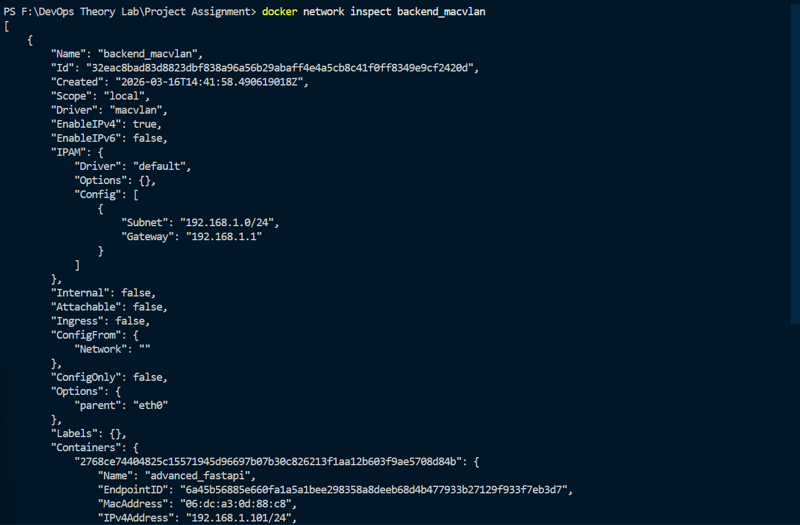
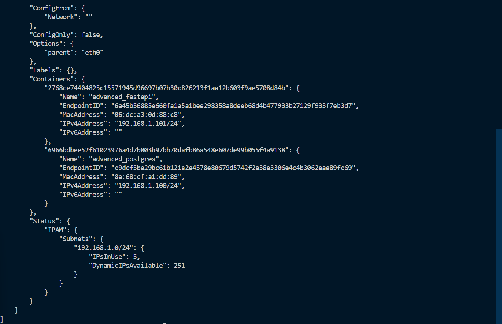

Verify port exposure and container identity.
```powershell
docker ps --filter "name=advanced"
```
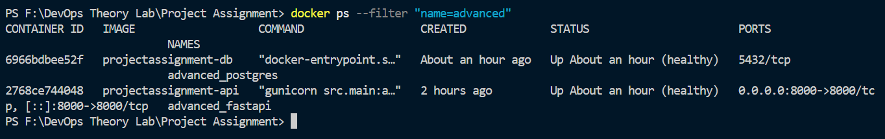

### 4.2 Orchestration Health
Validate service state and health-probes.
```powershell
docker-compose ps
```
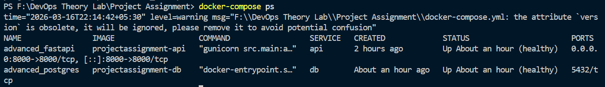

Monitor real-time system logs.
```powershell
docker-compose logs
```
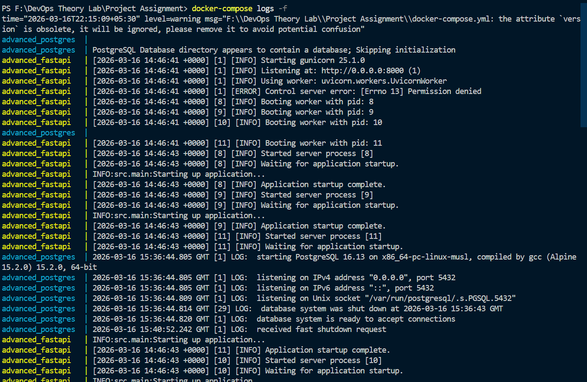
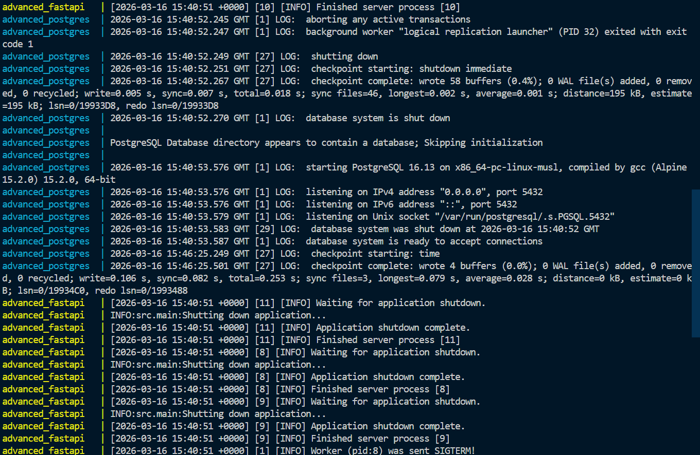
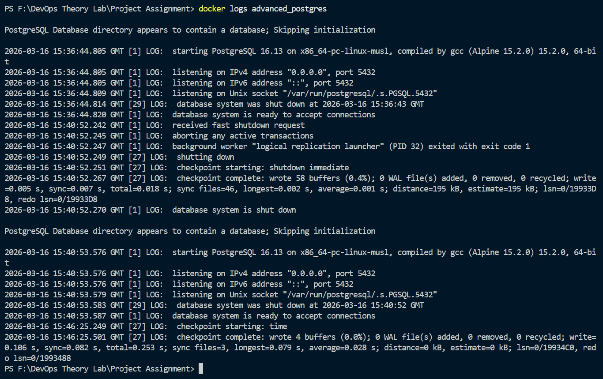

### 4.3 Database Schema & Persistence
Confirm the migration lifecycle and direct database accessibility.

```powershell
docker exec advanced_fastapi alembic history --verbose
```
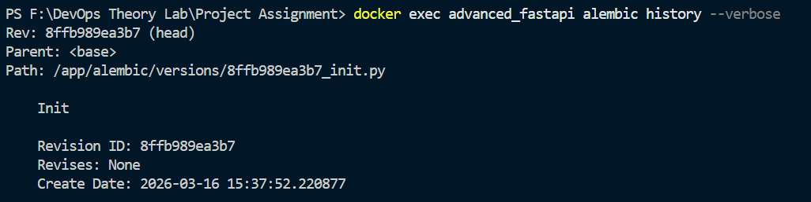

```powershell
docker exec advanced_fastapi alembic current
```
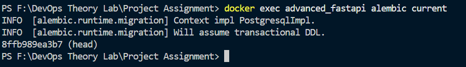

#### Direct Database Verification (PostgreSQL CLI)
Access the database directly to verify internal structure and tables.
```powershell
docker exec -it advanced_postgres psql -U postgres -d webapp_db
```
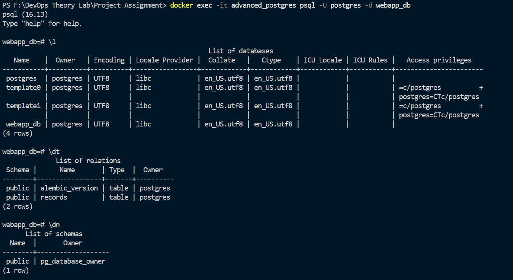
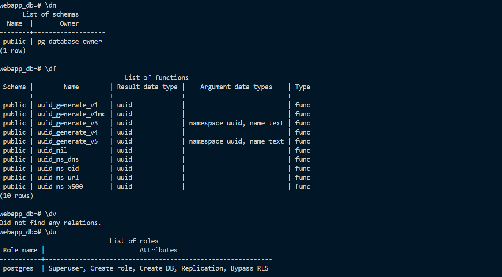

### 4.4 Functional API Compliance
Execute standard RESTful operations via the FastAPI gateway.

```powershell
# API Health Heartbeat
docker exec advanced_fastapi curl -s http://localhost:8000/api/v1/health
```
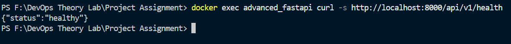

```powershell
# Record Creation (Manual Verification POST)
docker exec advanced_fastapi curl -s -X POST -H "Content-Type: application/json" -d "{\`"name\`": \`"Ultimate Verification\`", \`"description\`": \`"Proof of Concept\`"}" http://localhost:8000/api/v1/records
```
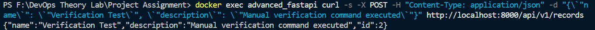

```powershell
# Record Retrieval (FastAPI URL GET)
docker exec advanced_fastapi curl -s http://localhost:8000/api/v1/records
```
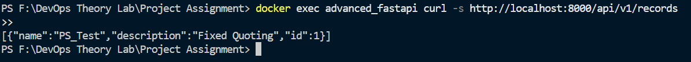

---

## 5. Project Deliverables Matrix

| Deliverable | Technology Stack | Status |
| :--- | :--- | :--- |
| Backend API | FastAPI, Gunicorn, Uvicorn | Completed |
| Database | PostgreSQL 16 (Alpine-optimized) | Completed |
| Networking | Macvlan L2 Driver | Completed |
| Orchestration | Docker Compose (v3.9) | Completed |
| Monitoring | Docker Stats, Healthchecks | Completed |
| Governance | Alembic Migrations | Completed |

---

## 6. Future Scalability Considerations
While the current stack is robust for single-host deployment, the architecture is "Cloud-Ready":
1. **Orchestrator Shift**: Readiness for Kubernetes (K8s) via Service resources.
2. **Horizontal Scaling**: The API is stateless and can be scaled horizontally.
3. **Observability**: Prometheus endpoints can be easily added to the FastAPI middleware.
