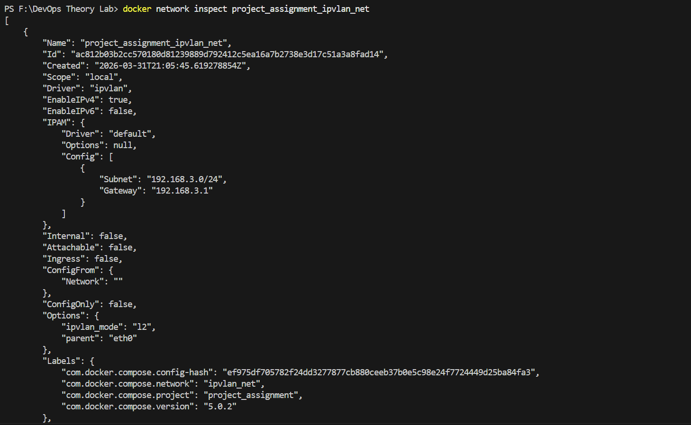
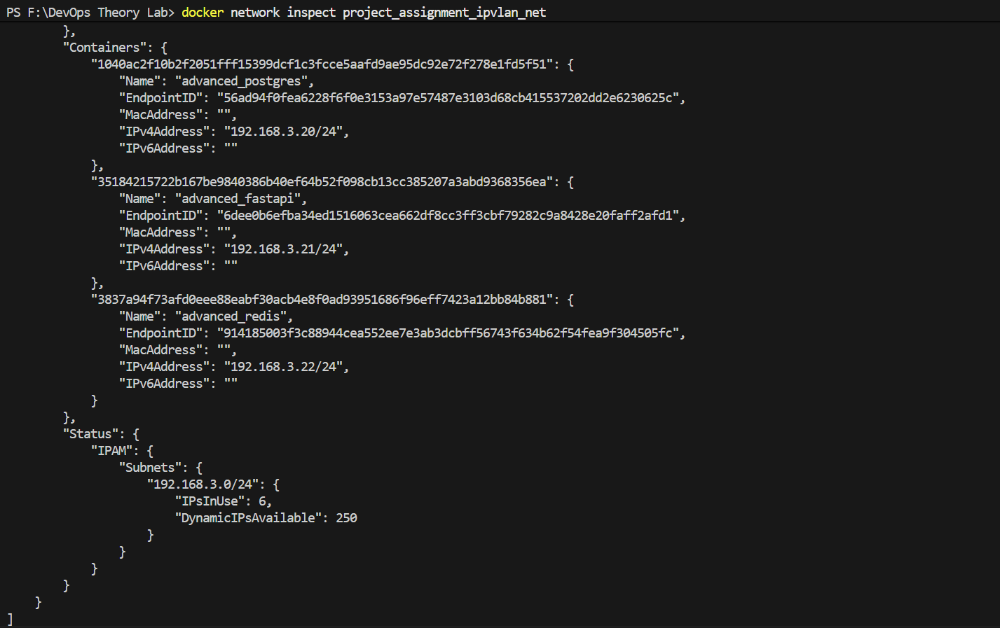
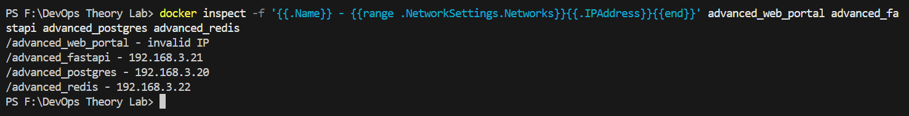
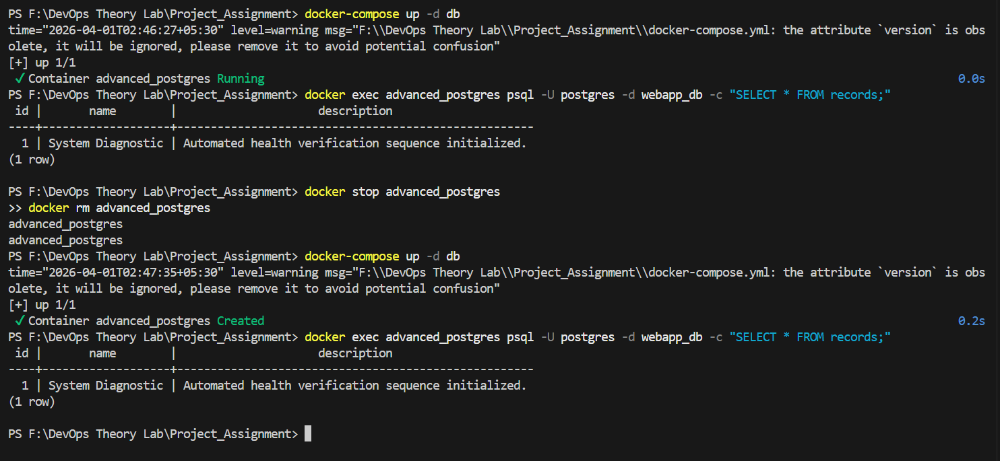

# Project Final Report
## Containerized Web Application with PostgreSQL using Docker Compose and IPvlan

Course: DevOps Theory Lab
Assignment: Project Assignment 1

---

### 1. Build Optimization and Image Sizing

The core engineering approach for building the backend and frontend components utilized Multi-Stage Docker Builds. In a development lifecycle, images often require substantial build tools, compilers (e.g., gcc), and system headers to install application dependencies. For example, compiling Python cryptography or bcrypt libraries requires extensive toolchains.

By employing multi-stage builds, we logically separate the build environment from the execution environment:
- Stage 1 (Builder): Uses a heavier base image (python:3.11-slim combined with build-essential). The dependencies are compiled into standalone Python wheels (.whl) files or placed in an isolated virtual environment. 
- Stage 2 (Runtime): Uses a pristine, minimal base image (python:3.11-slim). It copies only the compiled artifacts from the Builder stage, discarding all compilation toolchains.

#### Image Size Comparison
- Without Optimization: A typical Python image containing build dependencies (e.g., python:3.11) exceeds 900 MB to 1.1 GB.
- With Multi-Stage Optimization: Our final FastAPI backend image is reduced to approximately 180 MB. The Alpine-based database and Redis images are even smaller, drastically decreasing deployment latency, network overhead, and potential exploit attack surfaces.

---

### 2. Network Architecture: IPvlan vs. Macvlan

In modern container orchestration, deploying services to a local area network (LAN) often requires bypassing standard nat-bridge isolation. The two primary Linux drivers for this are Macvlan and IPvlan.

#### Macvlan
Macvlan assigns a unique, randomly generated MAC address to each container. The host physical network interface card (NIC) essentially operates in promiscuous mode, tricking the physical switch into believing multiple distinct physical devices are connected to the same port.
- Limitation (Host Isolation Issue): By design in the Linux kernel, a container attached to a Macvlan network cannot communicate with the host machine own IP address over that interface. Furthermore, many modern enterprise switches and wireless NICs strictly reject multiple MAC addresses originating from a single port for security reasons.

#### IPvlan (L2 Mode)
We chose IPvlan for this architecture. Unlike Macvlan, IPvlan shares the single physical MAC address of the host machine but assigns distinct IP addresses to the containers.
- Advantage: Since only one MAC address traverses the physical switch port, IPvlan bypasses stringent switch security policies and wireless card limitations. It provides the same direct LAN-level IP routing as Macvlan without the layer-2 MAC address pollution.

---

### 3. Network Design Diagram

Our architecture connects four primary containers via the project_assignment_ipvlan_net configuration, routed seamlessly onto the physical LAN (192.168.3.0/24).

                                [Physical LAN: 192.168.3.0/24]
                                               |
                                        [Host Machine]
                                     (Parent Interface: eth0)
                                               |
  ========================================================================================
  |                                 Docker IPvlan Subnet                                 |
  |                                                                                      |
  |   +-----------------------+                            +-------------------------+   |
  |   | advanced_web_portal   |                            | advanced_fastapi        |   |
  |   | (Nginx Frontend)      |                            | (FastAPI Backend)       |   |
  |   | IP: 192.168.3.23      |<---- REST API HTTP ------->| IP: 192.168.3.21        |   |
  |   | Port: 8081            |                            | Port: 8000              |   |
  |   +-----------------------+                            +-------------------------+   |
  |                                                              |                       |
  |                  +-------------------------------------------+                       |
  |                  |                                           |                       |
  |                  v                                           v                       |
  |   +-----------------------+                            +-------------------------+   |
  |   | advanced_redis        |                            | advanced_postgres       |   |
  |   | (Redis Cache)         |                            | (PostgreSQL 16)         |   |
  |   | IP: 192.168.3.22      |                            | IP: 192.168.3.20        |   |
  |   | Port: 6379 (Internal) |                            | Port: 5432 (Internal)   |   |
  |   +-----------------------+                            +-------------------------+   |
  |                                                                                      |
  |                                                        ** Persistent Data Storage ** |
  |                                                        Mounted: advanced_pgdata      |
  ========================================================================================

---

### 4. Proof of Implementation

(Please find the required implementation screenshots below)

1. docker network inspect Output:

2. Container IP Demonstrations:

3. Volume Persistence Test (Restarting Postgres container with previously inserted data):

